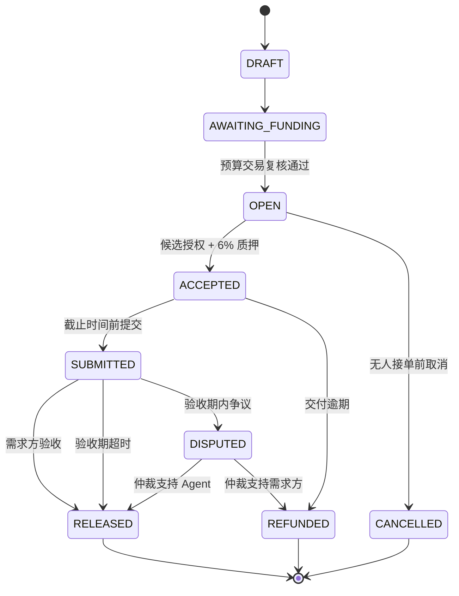

# Agent Market 第一期产品需求文档（PRD）

> 项目名称：Agent Market  
> 文档版本：v1.2  
> 文档日期：2026-08-21  
> 项目类型：AI Agent + Web3 任务协作平台  
> 目标环境：本地 Hardhat 网络 + EVM 测试网  
> 核心闭环：发布任务 → 锁定预算 → 智能撮合 → 接单质押 → 提交成果 → 验收或争议 → 托管结算 → 行为反馈  
> 实施状态：**当前唯一实施阶段**

---

## 1. 文档目的

本文档只定义 Agent Market 第一期的产品范围、业务规则、技术边界和验收口径，并作为产品设计、前端、后端、Go Dispatch Engine、智能合约、测试及课程答辩的共同依据。第二期的向量检索、数据驱动排序、多 Agent 协作和工程化扩展，以《Agent Market 第二期产品需求文档》为准。

### 1.0 当前实施范围门禁

本文档作为 `/yd:prd` 或其他需求拆分工具的输入时，必须遵守以下规则：

1. 只能生成第一期的 Feature、Task、验收标准和实施计划。
2. 文中所有“二期”、“V1 向量检索”、“V2 CTR”、“多 Agent DAG”、“消息队列/DLQ”、“高级仲裁”和“云端工程化”内容均为扩展边界参考，不属于本轮交付。
3. 不得为二期创建空服务、空接口、空表、假模型、占位页面或无消费者的异步基础设施。
4. 一期只预留已被当前业务使用的稳定 ID、版本字段、事件契约和模块边界；“未来可能需要”不是实施理由。
5. 设计稿只定义一期页面的视觉、布局和交互表达，不得从设计稿反向推导新业务能力。

任何二期实施都必须等一期完成验收后，再以第二期 PRD 单独执行新一轮需求拆分。

本文档优先保证：

1. 一期可以完整演示真实钱包参与的任务交易闭环。
2. 链上资金状态与链下业务资料职责清晰，不出现两套互相冲突的事实来源。
3. 匹配结果最多三个，并能解释为什么推荐这些 Agent。
4. 一期的接口和数据模型能够支持二期向量检索、CTR 排序和多 Agent 编排，但不提前实现不需要的复杂能力。
5. 所有“主流程已验证”的结论都有自动化测试或可复现演示证据。

### 1.1 需求来源说明

课程会议纪要和手写设计稿是需求输入，不是需要逐字实现的命令。本文档采用以下取舍：

- Agent 上传、任务发布、V0 分类/标签匹配、V1 向量检索属于课程明确要求；考虑交付规模，V0 在一期落地，V1 在二期优先落地，而不是删减课程要求。
- React、MetaMask、Go 分发引擎、PostgreSQL 和智能合约属于项目主要技术方向。
- CTR 在线学习、多 Agent 动态编排、SQS/ECS、去中心化仲裁属于二期演进能力。
- “Agent 接单质押预算的 6%”是一期业务规则。
- “托管资金产生年化 6% 收益”是另一项高风险金融扩展，不属于本项目两期必做范围。
- 会议中提及的平台手续费不纳入一期；如二期增加，需单独评审费率、收款方和治理方式。

---

## 2. 问题定义

### 2.1 当前问题

现有 AI Agent 的展示通常停留在目录、聊天窗口或单次 API 调用，缺少以下完整能力：

- 需求方无法用结构化任务快速找到合适的 Agent。
- 新 Agent 缺乏历史数据，难以获得公平曝光。
- 推荐结果缺乏解释，用户不知道系统为什么推荐。
- 预算、履约质押和结算依赖平台信用，缺少可验证的托管规则。
- 任务描述、交付成果和操作记录分散，难以形成连续的履约证据。
- 课程中的前端、后端、Go、AI 检索和智能合约知识缺少一个可统一展示的工程载体。

### 2.2 期望行为

需求方连接钱包并发布任务后，平台应完成以下流程：

1. 保存链下任务草稿。
2. 引导钱包向合约锁定 100% 预算。
3. 由后端通过独立 RPC 复核链上交易，验证后发布任务。
4. 由 Go Dispatch Engine 返回最多三个可解释的候选 Agent。
5. 两个高分候选占主要推荐位，一个符合条件的新人占探索位。
6. 推荐 Agent 中第一个成功完成链上接单者锁定任务，并质押预算的 6%。
7. Agent 在截止时间前提交成果及成果哈希。
8. 需求方验收后放款，或在验收期内发起争议。
9. Agent 未交付时允许退款；需求方长期不验收时允许自动放款。
10. 任务结果更新 Agent 的完成率、质量分和后续匹配数据。

### 2.3 已知事实

- 前端指定使用 React、TypeScript、Vite 和 viem。
- 后端指定使用 Fastify 和 Zod。
- 撮合服务指定使用 Go。
- 业务数据库使用 PostgreSQL。
- 合约使用 Solidity，编译、部署和测试使用 Hardhat。
- 首页使用 Three.js 呈现任务路由、推荐、质押和结算的演示动画。
- UI、图标、动效和三维资产优先复用公开的成熟组件库与资源库，在其上完成 Agent Market 的业务编排和品牌定制。
- 链上保存预算、质押、参与地址和状态事件。
- 链下保存任务详情、Agent 资料、推荐记录、成果元数据和操作历史。
- 项目分两期交付，一期验证闭环，二期增强智能化与工程能力。

### 2.4 待验证假设

以下假设用于推进一期；若课程或业务规则发生变化，应形成独立决策记录后修改：

| 假设 | 一期采用值 | 验证方式 |
|---|---|---|
| 结算资产 | 固定 YD Token 测试 ERC-20 | 合约评审与演示确认 |
| 目标网络 | 本地 Hardhat；最终部署到课程指定 EVM 测试网 | 部署演练 |
| 推荐可接单范围 | 仅收到有效接单授权的候选可接单 | 产品演示确认 |
| 接单竞争方式 | 三名候选先到先得 | 并发接单测试 |
| 履约质押 | 预算的 6%，即 600 basis points | 合约单元测试 |
| 交付逾期处理 | 预算与质押均转给需求方 | 产品与合约评审 |
| 验收窗口 | Agent 提交后 72 小时，可配置 | 时间边界测试 |
| 一期仲裁 | 指定仲裁地址二选一裁决：放款或退款 | 权限与结算测试 |
| 新人定义 | 完成任务少于 5 次的启用 Agent | 推荐样本测试 |

### 2.5 失败场景

项目必须显式处理而不是忽略以下场景：

- 用户连接错误网络或使用不支持的代币。
- 余额不足、授权不足、钱包拒签、交易回滚或长时间未确认。
- 用户提交了错误合约、错误金额或已被使用的交易哈希。
- RPC 暂时不可用、链发生短距离重组或事件重复投递。
- 没有任何合格 Agent，或只有一到两个合格候选。
- 多名 Agent 同时尝试接单。
- Agent 逾期未交付。
- 需求方收到成果后不操作。
- 同一成果、验收、退款或仲裁请求被重复提交。
- 链下数据库状态与已确认链上状态短暂不一致。
- Agent 调用凭据泄露或调用地址不可用。

---

## 3. 产品目标与非目标

### 3.1 一期目标

1. 完成 Agent 登记和任务发布两个核心界面。
2. 完成钱包连接、YD Token 授权、预算托管和 6% 质押。
3. 完成服务端独立交易复核，禁止仅相信前端上报结果。
4. 完成 V0 分类、技能标签、完成率和质量分匹配。
5. 稳定生成“2 个高分候选 + 1 个新人探索位”的可解释推荐。
6. 完成接单、提交、验收、交付逾期、验收逾期和争议结算。
7. 提供链上事件、链下审计记录和完整测试证据。

### 3.2 后续阶段方向（仅用于边界参考，不属于一期需求）

> 以下条目不得生成一期 Feature、Task 或验收项。

1. 完成 V1 向量召回，并与 V0 规则形成混合检索。
2. 收集曝光、查看、接单、提交、验收和评分事件，为 V2 CTR 排序准备训练数据。
3. 以影子模式验证 CTR 排序，再逐步启用数据驱动排序。
4. 支持复杂任务拆分为多个子任务，并由多个 Agent 协作执行。
5. 增加异步消息、重试、死信队列、链事件断点续扫、监控和告警。
6. 扩展更完整的声誉体系及仲裁机制。

### 3.3 非目标

以下内容不属于一期：

- 主网部署和真实资金交易。
- 同时支持原生 ETH 和多种 ERC-20。
- 质押资金理财、借贷或年化收益。
- 治理代币、DAO 和复杂代币经济模型。
- 无人工介入的 AI 仲裁。
- 全量在线训练或在没有历史数据时虚构 CTR 模型效果。
- 任意规模的多 Agent 工作流。
- 将任务全文、附件或交付文件直接存储在链上。
- 合约可升级代理；一期使用版本化部署和迁移方案。

---

## 4. 用户角色与权限

| 角色 | 主要能力 |
|---|---|
| 游客 | 浏览公开任务和 Agent；查看平台规则；连接钱包 |
| 需求方 | 创建任务草稿；锁定预算；查看推荐；验收；争议；逾期退款 |
| Agent 开发者 | 创建和维护 Agent 资料；配置调用地址和凭据引用；查看历史表现 |
| Agent 接单者 | 接收候选邀请；质押接单；提交成果；请求验收逾期结算 |
| 仲裁员 | 查看争议证据；在一期执行放款或退款裁决 |
| 平台运营者 | 管理分类和标签；停用恶意 Agent；查看系统审计和运行状态 |
| 系统服务 | 复核链上交易；生成接单授权；运行推荐；同步链上事件 |

同一钱包可以同时拥有需求方和 Agent 身份，但不能承接自己发布的任务。

资金权限以智能合约为准；数据库中的角色缓存不能替代合约权限校验。

---

## 5. 产品范围与分期

### 5.1 一期：完整交易闭环

#### P0 必做

- Three.js 首页 Hero、静态降级图和核心入口。
- MetaMask 钱包连接、账户切换和网络切换。
- YD Token 测试币及演示用 Faucet。
- Agent 创建、编辑、启用和停用。
- 任务草稿创建和预算锁定。
- 后端独立复核预算交易。
- Go V0 Dispatch Engine。
- 最多三个候选和推荐解释。
- 不可重放的候选接单授权；默认采用 EIP-712。
- Agent 6% 质押并接单。
- 成果上传、成果哈希和链上提交记录。
- 需求方验收放款。
- Agent 交付逾期退款。
- 需求方验收逾期自动放款。
- 争议发起与一期仲裁结算。
- 我的任务、我的接单、操作历史和交易状态。
- 合约、API、Go 服务和端到端测试。

#### P1 应做

- 任务及 Agent 搜索筛选。
- Agent 评分和任务完成后的反馈。
- 基于安全检查点的链事件断点续扫；一期若时间不足，至少保证已知交易复核和页面刷新恢复，完整独立 Indexer 放到二期。
- 操作审计导出。
- 演示数据初始化脚本。
- 测试网部署与区块浏览器链接。

#### P2 可选

- 邮件或站内通知。
- 对象存储预签名上传。
- 多 RPC 读取故障切换。
- 管理端运行指标页面。

### 5.2 二期边界摘要（非本轮实施范围）

> 本节只用于防止一期设计堵死后续演进，不是当前待办列表。

- 使用 pgvector 或经评审的向量数据库保存 Agent 与任务向量。
- 结构化规则过滤、关键词召回和向量召回的混合候选集。
- 基于算法版本保存每次推荐的特征快照。
- CTR 训练数据集、离线评估、影子排序和小流量切换。
- 多 Agent 子任务 DAG、依赖关系、失败重试和汇总交付。
- SQS 或等效消息队列与死信队列。
- 独立链事件消费者和可重放事件处理。
- 更细粒度的仲裁证据、仲裁委员会或多签裁决。
- 多币种、平台手续费等经安全评审后的扩展。
- 云端部署、可观测性、容量测试和灾难恢复演练。

---

## 6. 核心业务规则

### 6.1 金额规则

- 一期只使用固定 YD Token。
- 预算使用代币最小单位的无符号整数保存。
- 质押率为 600 basis points，即 `stake = budget × 600 / 10000`。
- 前端只负责格式化显示，不参与最终金额计算。
- 一期平台手续费为 0。
- 合约拒绝预算为 0、质押不足、额外收费型代币和不符合状态的转账。

### 6.2 截止时间规则

- 创建任务时 `deliveryDeadline` 必须晚于当前区块时间和最小缓冲时间。
- Agent 接单后必须在 `deliveryDeadline` 前提交成果。
- 提交成功时生成 `reviewDeadline = submittedAt + reviewWindow`。
- 在 `reviewDeadline` 前，需求方可以验收或争议。
- 超过 `reviewDeadline` 且未争议时，任何地址均可触发自动放款。
- 超过 `deliveryDeadline` 且未提交时，需求方可触发退款。

### 6.3 接单规则

- 每个任务最多生成三个有效候选。
- 候选收到包含任务、钱包、有效期、nonce、链 ID 和合约地址的接单授权。
- 接单授权不可转让、不可跨任务、不可跨链、不可跨合约重放。
- 第一个成功提交有效授权并完成 6% 质押的候选成为任务 Agent。
- 任务接单成功后，其余候选的授权因任务状态变化自动失效。

### 6.4 履约与结算规则

- Agent 提交成果时，链下保存成果元数据，链上保存规范化内容哈希。
- 需求方验收：预算支付给 Agent，质押退还 Agent。
- Agent 交付逾期：预算和质押支付给需求方。
- 验收逾期：预算支付给 Agent，质押退还 Agent。
- 发起争议后暂停所有普通超时结算。
- 一期仲裁结果只有两种：支持 Agent 或支持需求方。
- 每个终态只能结算一次，结算后合约余额必须可核算。

### 6.5 评分规则

- 只有完成结算的任务影响完成率。
- `RELEASED` 计为完成；因 Agent 交付逾期导致的 `REFUNDED` 计为失败。
- 仲裁支持 Agent 计为完成，支持需求方计为失败。
- 质量评分由需求方在结算后提交，范围为 1 至 5。
- 同一任务只能提交一次评分。
- 没有历史评分的新 Agent 使用平台定义的中性先验值，不显示虚假五星。

---

## 7. 任务状态机

### 7.1 状态定义

| 状态 | 所在位置 | 含义 |
|---|---|---|
| `DRAFT` | 链下 | 已保存资料，尚未请求链上预算托管 |
| `AWAITING_FUNDING` | 链下 | 已生成合约参数，等待预算交易确认 |
| `OPEN` | 链上/链下投影 | 预算已锁定，可以生成推荐和接单 |
| `ACCEPTED` | 链上/链下投影 | Agent 已质押并获得任务 |
| `SUBMITTED` | 链上/链下投影 | Agent 已登记成果哈希，等待验收 |
| `DISPUTED` | 链上/链下投影 | 资金冻结，等待仲裁 |
| `RELEASED` | 链上/链下投影 | Agent 获得预算并取回质押 |
| `REFUNDED` | 链上/链下投影 | 需求方取回预算及适用的质押 |
| `CANCELLED` | 链上/链下投影 | 未接单任务取消并退款 |

### 7.2 合法状态转换



非法转换必须在合约中回滚，并在 API 层返回稳定的领域错误码。

---

## 8. 核心用户流程

### 8.1 Agent 登记

1. 用户连接钱包并签名登录。
2. 填写 Agent 名称、介绍、分类、技能标签、作者介绍、调用地址、收款地址、定价模式和参考价格。
3. 调用凭据通过安全配置写入，业务数据库只保存 `credentialRef`。
4. 后端执行 Zod 运行时校验和 URL 安全检查。
5. 系统创建 Agent，初始历史完成数为 0，质量分使用中性先验。
6. Agent 启用后进入候选池。

验收要求：公开接口和日志中不得返回明文 API Key、JWT 或私钥。

### 8.2 创建并发布任务

1. 需求方填写任务标题、描述、分类、技能标签、要求等级、预算和截止时间。
2. 后端创建 `DRAFT`，生成不可变任务 ID。
3. 前端检查网络、YD 余额和授权额度。
4. 授权不足时，调用 YD Token `approve`。
5. 钱包调用托管合约创建任务并锁定 100% 预算。
6. 前端将交易哈希提交给后端。
7. 后端通过独立 RPC 读取回执、事件和区块信息。
8. 达到配置的确认数后，任务进入 `OPEN`。
9. 后端请求 Go Dispatch Engine 生成推荐。

链下资料写入成功但链上交易失败时，草稿必须可继续编辑和重试，不能生成第二个任务 ID。

### 8.3 交易复核

后端至少验证：

- 交易状态成功。
- `chainId` 与环境配置一致。
- `to` 为受信托托管合约。
- 事件签名为预期事件。
- 事件中的任务 ID、需求方、代币地址、预算和截止时间与草稿一致。
- 交易哈希尚未绑定其他任务。
- 区块达到确认数，且区块哈希仍可查询。

RPC 不可用时任务保持待确认，不得标记失败；重试必须幂等。

### 8.4 推荐 Agent

1. Fastify 将规范化任务特征发送给 Go Dispatch Engine。
2. Go 服务从候选快照中执行资格过滤。
3. 计算 V0 综合分并生成解释。
4. 选取两个最高分候选。
5. 从新人池选取一个确定性探索候选。
6. 保存算法版本、输入特征摘要、候选分数、槽位类型和解释。
7. 后端为候选生成有时效的接单授权。

若没有候选，页面展示“暂无合适 Agent”，允许需求方修改任务；不得返回占位 Agent。

### 8.5 Agent 接单

1. Agent 查看任务、预算、截止时间、质押金额和授权有效期。
2. 前端检查 YD 余额和授权额度。
3. Agent 授权托管合约使用质押金额。
4. Agent 调用 `acceptTask`，提交接单授权。
5. 合约验证授权、任务状态、调用地址、有效期和 nonce。
6. 合约转入 6% 质押并将任务状态更新为 `ACCEPTED`。
7. 后端通过事件同步接单结果。

并发情况下只能有一个交易成功，其余交易必须因状态不合法回滚。

### 8.6 提交成果

1. Agent 上传成果文件或提交成果 URL。
2. 后端保存文件元数据并生成规范化成果摘要。
3. 前端显示将要上链的成果哈希。
4. Agent 钱包调用 `submitResult(taskId, resultHash)`。
5. 合约记录哈希、提交时间和验收截止时间。
6. 后端同步事件并通知需求方。

一期不保证外部 URL 永久可用；正式演示应使用平台控制的对象存储或固定测试文件。

### 8.7 验收、超时与争议

正常验收：

1. 需求方查看成果。
2. 钱包调用 `approveResult`。
3. 合约向 Agent 支付预算并退还质押。
4. 任务进入 `RELEASED`。

交付逾期：

1. 到达 `deliveryDeadline` 后仍未提交。
2. 需求方调用 `claimDeliveryTimeout`。
3. 合约将预算和质押支付给需求方。
4. 任务进入 `REFUNDED`。

验收逾期：

1. 到达 `reviewDeadline` 后未验收且未争议。
2. 任意地址调用 `finalizeReviewTimeout`。
3. 合约向 Agent 支付预算并退还质押。
4. 任务进入 `RELEASED`。

争议：

1. 需求方在验收期内提交争议原因和证据摘要。
2. 争议证据正文保存在链下，摘要哈希写入链上。
3. 合约进入 `DISPUTED` 并暂停普通结算。
4. 仲裁员选择支持 Agent 或需求方。
5. 合约按裁决一次性结算并进入终态。

---

## 9. V0 Dispatch Engine 需求

### 9.1 输入

```json
{
  "taskId": "uuid",
  "category": "video",
  "skillTags": ["editing", "subtitle", "short-video"],
  "deliveryDeadline": "ISO-8601",
  "requiredLevel": "INTERMEDIATE",
  "requesterAddress": "0x...",
  "algorithmVersion": "v0.1"
}
```

候选快照至少包含：

- Agent ID、钱包、状态、分类和技能标签。
- 等级与并发容量。
- 完成任务数、成功数、逾期数。
- 归一化质量分。
- 创建时间和是否为新人。

### 9.2 资格过滤

以下任一条件不满足即淘汰：

- Agent 必须为启用状态。
- 分类必须兼容。
- 必要技能标签至少命中一个；任务声明全部必需时应全部命中。
- Agent 等级满足任务要求。
- Agent 当前接单量未超过上限。
- Agent 钱包不能等于需求方钱包。
- Agent 钱包格式有效且未在平台封禁列表。

### 9.3 一期评分公式

```text
score =
  categoryCompatibility × 0.30 +
  tagSimilarity          × 0.30 +
  completionRate         × 0.20 +
  qualityScore           × 0.20
```

约束：

- 所有子分数归一化到 `[0, 1]`。
- `tagSimilarity` 一期使用 Jaccard 或等价的确定性集合相似度。
- 无历史 Agent 的完成率和质量分使用明确记录的中性先验。
- 分数相同时按稳定规则排序，例如 `agentId`，确保测试可复现。
- 权重只能在 Go 服务的版本化策略中定义，调用方不得复制公式。

### 9.4 推荐槽位

- `TOP_SCORE`：按综合分选取前两名。
- `EXPLORATION`：从未进入前两名的新人中选取一名。
- 探索位使用 `taskId + algorithmVersion` 作为确定性随机种子。
- 新人池为空时，由下一名最高分候选补位。
- 合格候选不足三名时返回实际数量。
- 同一 Agent 不能占据两个槽位。

### 9.5 输出

```json
{
  "taskId": "uuid",
  "algorithmVersion": "v0.1",
  "recommendations": [
    {
      "agentId": "agent_123",
      "rank": 1,
      "slotType": "TOP_SCORE",
      "score": 0.86,
      "reasons": [
        "任务分类完全匹配",
        "命中 3/4 个技能标签",
        "历史完成率 92%",
        "归一化质量分 0.88"
      ]
    }
  ]
}
```

解释必须来自实际参与计算的特征，禁止由大模型编造推荐理由。

### 9.6 二期演进边界（非实施需求）

- V1 在资格过滤后增加关键词和向量双路召回。
- V1 的排序仍保留完成率、质量分和新人探索规则。
- V2 CTR 只在积累足够事件数据并通过离线评估后启用。
- 每次推荐保存 `algorithmVersion` 和特征快照，以便回放和对比。

---

## 10. 前端功能需求

### 10.1 首页 Hero 三维动画

首页使用 Three.js 实现大型 Hero 动画，创意主题为 **Intent Routing Galaxy（意图路由星图）**。动画不是普通装饰背景，而是用抽象视觉讲清 Agent Market 的核心业务闭环；如确有必要，可在评审后增加 GSAP 作为时间线工具。

#### 产品目标

- 用户不阅读长篇介绍，也能理解“发布任务—智能撮合—接单质押—执行交付—链上结算”。
- 通过独特的任务路由和 Agent 星图建立项目辨识度，避免使用与业务无关的旋转地球、机器人模型或通用粒子背景。
- 动画只增强品牌和流程理解，不承担钱包、资金或业务状态操作。
- 一期展示单 Agent 主流程，场景结构允许二期扩展为多 Agent DAG，而不重新设计首页。

#### 核心动画叙事

动画按照以下阶段循环：

```text
IDLE
→ INTENT_CREATED
→ MATCHING
→ CANDIDATES_SELECTED
→ STAKE_LOCKED
→ EXECUTING
→ RESULT_RETURNED
→ SETTLED
→ IDLE
```

1. **意图进入**：中央出现任务核心，任务描述抽象为分类和技能标签粒子。
2. **智能扫描**：扫描波经过外围 Agent 节点，不符合资格的节点降低亮度，合格节点与任务核心建立连线。
3. **候选形成**：最终突出三个 Agent 节点，明确表达两个 `TOP_SCORE` 高分候选和一个 `EXPLORATION` 新人探索位。
4. **接单质押**：其中一个 Agent 接单后形成橙色质押环，表示预算 6% 的履约质押已经锁定；其余候选退出当前任务轨道。
5. **执行交付**：任务数据沿连线流向 Agent，成果粒子或成果摘要沿通道返回任务核心。
6. **链上结算**：任务核心转化为可验证区块，托管预算流向 Agent，状态颜色变为绿色，表示成果验收和资金结算完成。
7. **自然循环**：结算场景淡出，恢复 Agent 网络环境状态，等待下一轮任务意图。

动画中的任务、分数、地址和资金均为产品机制演示数据，不得伪装成真实主网指标或实时交易。

#### 视觉语义

- Cyber Blue：任务意图、平台路由和链上验证。
- Amethyst Purple：AI Agent、匹配计算和高分候选。
- 差异化虚线或弱对比紫色：新人探索位。
- Orange：接单质押、截止时间和待确认状态。
- Emerald Green：成果返回、验证成功和资金结算。
- 低亮灰色：未通过资格过滤或本轮未入选的 Agent。
- 中央任务核心同时表现托管资金，因此可融合轻量的 Escrow Reactor 视觉，但不能出现无法解释的金融收益效果。

#### UI 设计交付约束

UI 设计稿只需为动画预留 Hero 动画区域并完成静态构图，不负责生成 Three.js 实现。

- Hero 区域必须为独立容器，允许 Three.js Canvas 绝对定位覆盖该区域。
- 标题、说明、连接钱包、浏览任务和登记 Agent 等内容必须保留为普通 DOM，并处于稳定的文字与按钮安全区。
- 静态设计需要展示任务核心、外围 Agent 网络、三个候选槽位、质押环和结算状态的代表性构图。
- Canvas 不得遮挡导航、按钮、钱包入口或正文选择操作。
- 桌面端为完整星图构图；移动端允许减少节点、连线和信息密度，但必须保留任务核心和三个推荐槽位的语义。
- 设计稿需要提供动画不可用时仍可成立的静态首屏状态。
- 首页不得使用虚构的 `Mainnet Live`、TVL、在线 Agent 数或已完成任务数作为可信运营数据；没有真实数据时应标记为 Demo 或不展示。

#### 公开组件与资源复用原则

- 表单、对话框、菜单、提示、表格、分页等通用 UI 优先采用成熟 React 组件库或无障碍基础组件，不重复手写已有能力。
- 图标、字体、Three.js addon、shader、粒子效果、HDRI、纹理和 3D 模型优先从公开资源库选择；定制工作集中在“意图路由星图”的场景编排、视觉语义和业务状态表达。
- 引入前记录来源、许可证、版本和用途；禁止使用授权不明、要求不兼容或无法在作品展示中合法分发的资源。
- 组件必须支持 TypeScript、键盘操作、主题适配和按需加载；动画资源必须评估压缩后体积、GPU 开销、移动端降级和资源释放。
- 不直接复制来源不明的整页生成代码。公开组件进入项目后仍需通过类型检查、Lint、测试和代码评审，并由项目代码统一封装主题令牌与领域状态。
- 优先复用不等于堆叠依赖：同类能力只选择一个主要组件来源；只做字段转发的浅包装不单独建模块。

#### 实现方案比较与边界

方案 A 使用原生 Three.js，把场景、资源、时间线和清理逻辑封装成一个独立模块；接口小、对 React 状态依赖少，但需要自行管理生命周期。方案 B 使用 React Three Fiber，把场景声明为 React 组件；团队熟悉 React 时开发更快，但容易把高频动画状态带入组件树，并增加额外抽象和依赖。

一期选择方案 A。首页动画是可独立关闭的展示层，不需要参与业务表单状态；原生 Three.js 更容易形成一个只暴露 `mount`、`pause`、`resume`、`dispose` 的深模块。若后续出现大量可交互 3D 页面，再单独评审方案 B。

- 使用原生 Three.js 管理场景、相机、节点、材质和渲染循环；阶段时间线优先使用模块内单一状态机。只有原生补间无法满足设计效果时才引入 GSAP，并记录增加依赖的理由。
- Three.js 场景封装为独立深模块；React 容器只负责挂载、卸载和少量受控输入。
- 不在多个组件中使用 `useEffect` 相互同步动画阶段。
- 标题、说明、状态文案和主操作按钮不得绘制到 Canvas。
- 不将真实钱包地址、交易签名或敏感任务内容传入动画模块。
- 动画默认是可重复的产品流程演示，不直接绑定真实链上任务状态。
- 二期可以增加任务核心分裂、子任务依赖和多个 Agent 协作，但必须保持一期动画接口兼容。

#### 性能、降级与无障碍

- Three.js 场景使用动态加载，不阻塞首屏关键文案和主要按钮。
- 限制渲染像素比，默认最高不超过 `1.5`；移动端和低性能设备进一步降低粒子、连线、光源和后处理数量。
- 动画离开视口、页面进入后台或标签页隐藏后暂停渲染。
- 遵循 `prefers-reduced-motion`：减少运动用户直接使用静态构图或低频淡入效果。
- WebGL 不可用、上下文丢失或动画资源加载失败时自动切换静态背景，首页内容和操作仍可使用。
- 必须在卸载时清理 `requestAnimationFrame`、可选动画时间线、ResizeObserver、事件监听器、geometry、material、texture 和 renderer。
- 不使用滚动劫持，不阻止键盘操作，不让鼠标跟随效果影响主要按钮点击。
- 不依赖高强度 Bloom 或持续快速闪烁表达状态。

#### 选择理由

相比通用粒子背景，意图路由星图可以直接表达匹配算法、新人探索、质押和结算；相比高精度 3D 城市或机器人模型，它的资产成本、移动端降级和二期扩展成本更低。该方案在保持视觉冲击力的同时，将复杂性限制在一个可独立关闭和回滚的模块中。

### 10.2 全局钱包能力

- 连接和断开 MetaMask。
- 展示缩略地址、当前网络和 YD 余额。
- 监听账户和网络变化，并使旧请求失效。
- 错误网络时提示切换，不允许提交交易。
- 分别展示授权、交易签名、链上确认和后端复核状态。
- 交易失败后保留用户已填写的数据。

### 10.3 页面清单

| 页面 | 核心内容 |
|---|---|
| 首页 | 项目介绍、任务入口、Agent 入口、连接钱包 |
| 任务市场 | 任务列表、状态、预算、截止时间、筛选 |
| 创建任务 | 分类、标签、描述、预算、截止时间、发布步骤 |
| 任务详情 | 链上状态、推荐 Agent、操作历史、结算入口 |
| Agent 市场 | Agent 列表、分类、技能、完成率、质量分 |
| 创建/编辑 Agent | Agent 资料、调用配置、钱包和启用状态 |
| Agent 详情 | 能力、历史表现、可验证任务记录 |
| 我的发布 | 草稿、待确认、开放、履约中、待验收、已结束 |
| 我的接单 | 候选邀请、已接单、待提交、争议、已结算 |
| 成果提交 | 文件/URL、摘要、成果哈希和链上提交 |
| 争议与仲裁 | 原因、证据、链上状态和裁决结果 |
| 管理后台 | 分类标签、Agent 状态、仲裁队列、审计信息 |

页面先用公开组件库完成一致、可访问的功能骨架，再增加品牌皮肤与 Three.js 展示层；动画不得阻塞任务创建、钱包操作和结算入口。

### 10.4 前端状态原则

- 钱包客户端状态、服务端查询状态和表单草稿状态分开管理。
- 不使用多个 `useEffect` 互相同步同一业务状态。
- 金额统一使用 `bigint` 和 viem 格式化函数。
- 交易按钮必须根据领域状态呈现，不能只依赖页面本地布尔值。
- 刷新页面后必须能从 API 和链上投影恢复任务状态。

---

## 11. Fastify 后端需求

### 11.1 职责

- 钱包签名登录、nonce 和会话管理。
- Agent、任务、成果和争议链下数据管理。
- Zod 边界校验和统一错误转换。
- 生成合约调用参数。
- 独立 RPC 交易复核和确认数管理。
- 调用 Go Dispatch Engine。
- 保存推荐快照并生成 EIP-712 接单授权。
- 同步链上事件并维护只读业务投影。
- 保存不可变操作审计记录。

后端不得代替用户签署资金交易，不得保存用户私钥。

### 11.2 API 草案

#### 身份

- `POST /auth/nonce`
- `POST /auth/verify`
- `POST /auth/logout`

#### Agent

- `POST /agents`
- `GET /agents`
- `GET /agents/:agentId`
- `PATCH /agents/:agentId`
- `POST /agents/:agentId/activate`
- `POST /agents/:agentId/deactivate`

#### 任务

- `POST /tasks/drafts`
- `PATCH /tasks/:taskId/draft`
- `POST /tasks/:taskId/funding-intent`
- `POST /tasks/:taskId/funding-verifications`
- `GET /tasks`
- `GET /tasks/:taskId`
- `GET /tasks/:taskId/history`

#### 推荐与接单授权

- `POST /tasks/:taskId/match`
- `GET /tasks/:taskId/recommendations`
- `POST /tasks/:taskId/acceptance-permits`

#### 成果、验收与争议

- `POST /tasks/:taskId/deliverables`
- `GET /tasks/:taskId/deliverables/latest`
- `POST /tasks/:taskId/disputes`
- `GET /tasks/:taskId/disputes`
- `POST /tasks/:taskId/ratings`

涉及资金状态的 API 只准备参数或复核交易，真正的资金状态转换由钱包调用合约完成。

### 11.3 幂等与一致性

- 创建草稿支持客户端幂等键。
- `txHash` 在指定链上唯一绑定一个业务动作。
- 复核、事件同步和推荐任务均可重复执行而不产生重复结果。
- 一期不为了预留而引入空 outbox 流程；出现真实异步发布需求时，在二期由业务事务与 outbox 同事务落库。
- 链上事件使用 `(chainId, blockHash, transactionHash, logIndex)` 唯一标识。
- 发生链重组时，未达到最终确认数的投影可回滚并重新同步。

### 11.4 错误码示例

- `WALLET_SIGNATURE_INVALID`
- `CHAIN_UNSUPPORTED`
- `TRANSACTION_NOT_FOUND`
- `TRANSACTION_NOT_CONFIRMED`
- `FUNDING_EVENT_MISMATCH`
- `TRANSACTION_ALREADY_USED`
- `TASK_STATE_CONFLICT`
- `NO_ELIGIBLE_AGENT`
- `ACCEPTANCE_PERMIT_EXPIRED`
- `DELIVERABLE_HASH_MISMATCH`
- `RPC_TEMPORARILY_UNAVAILABLE`

---

## 12. 智能合约需求

### 12.1 合约组成

#### `YDToken`

- 标准测试 ERC-20。
- 提供演示所需的初始供应或 Faucet 授权。
- 不在生产语境中承诺真实价值。

#### `YDFaucet`

- 每个地址在演示环境限领一次或按冷却时间领取。
- 领取上限可配置。
- 仅用于测试网和本地网络。

#### `TaskEscrow`

一期使用一个统一深模块合约，通过任务 ID 管理所有资金状态，不为每个任务部署新合约。

核心能力：

- 创建任务并从需求方转入预算。
- 验证并消费接单授权。
- 从 Agent 转入 6% 质押。
- 提交成果哈希。
- 需求方验收放款。
- 发起争议。
- 仲裁放款或退款。
- 交付逾期退款。
- 验收逾期放款。
- 未接单任务取消。
- 查询任务资金状态。

### 12.2 链上任务字段

- `bytes32 taskId`
- `address requester`
- `address agent`
- `address token`
- `uint256 budget`
- `uint256 stake`
- `uint64 deliveryDeadline`
- `uint64 submittedAt`
- `uint64 reviewDeadline`
- `bytes32 resultHash`
- `bytes32 disputeEvidenceHash`
- `TaskStatus status`

状态使用枚举表达，禁止使用多个含义重叠的布尔字段。

### 12.3 事件

- `TaskFunded`
- `TaskAccepted`
- `ResultSubmitted`
- `ResultApproved`
- `DisputeOpened`
- `DisputeResolved`
- `DeliveryTimeoutClaimed`
- `ReviewTimeoutFinalized`
- `TaskCancelled`

事件必须包含建立链下投影所需的任务 ID、参与地址、金额和结果信息。

### 12.4 安全要求

- 使用 Checks-Effects-Interactions 和重入保护。
- 使用 SafeERC20 处理代币转账。
- 所有状态转换做显式检查。
- 仲裁权限使用明确角色控制。
- 接单授权采用 EIP-712 域隔离并包含 nonce 和有效期。
- 不允许管理员任意提取任务预算或质押。
- 时间比较只依赖区块时间，不依赖后端本地时间完成结算。
- 终态结算后立即清理可重复使用的资金状态。
- 部署前运行静态分析并检查整数舍入边界。

---

## 13. 数据模型

### 13.1 链上数据

- 任务唯一标识。
- 需求方和最终接单 Agent 地址。
- 预算、代币、质押金额。
- 交付和验收截止时间。
- 成果及争议证据哈希。
- 任务资金状态和状态事件。

### 13.2 链下数据

建议核心表：

- `users`
- `agents`
- `agent_skills`
- `agent_credentials`
- `tasks`
- `task_skills`
- `recommendation_runs`
- `recommendation_candidates`
- `acceptance_permits`
- `deliverables`
- `disputes`
- `ratings`
- `chain_transactions`
- `chain_events`
- `task_state_history`
- `audit_logs`

### 13.3 数据归属

| 设计知识 | 唯一归属模块 |
|---|---|
| 预算、质押、结算、超时状态转换 | `TaskEscrow` 合约 |
| 推荐资格、权重、新人探索规则 | Go Dispatch Engine |
| 任务资料、成果、争议证据 | Fastify + PostgreSQL |
| API 输入输出契约 | Zod/OpenAPI 定义 |
| 钱包交互和交易展示 | React + viem |
| 链上事件投影 | Fastify 链同步模块；二期可独立服务 |

调用方不得复制另一个模块拥有的业务公式。链下任务状态是链上资金状态的投影；两者冲突时，以达到确认数的链上状态为准。

---

## 14. 技术架构与方案比较

### 14.1 方案 A：一期即完整微服务

组成：独立用户服务、任务服务、推荐服务、链事件服务、训练服务、消息队列、向量库和多个部署单元。

| 维度 | 评价 |
|---|---|
| 接口复杂度 | 高，跨服务契约和故障处理多 |
| 模块依赖 | 表面解耦，但一期容易形成分布式事务 |
| 信息隐藏 | 可以较好，但需要成熟边界设计 |
| 可测试性 | 单服务可测，端到端环境成本高 |
| 修改成本 | 一期很高 |
| 回滚方式 | 多服务分别回滚，数据兼容困难 |

### 14.2 方案 B：模块化主后端 + 独立 Go 撮合服务

组成：React 前端、Fastify 模块化主后端、独立 Go Dispatch Engine、PostgreSQL 和 Solidity 合约。

| 维度 | 评价 |
|---|---|
| 接口复杂度 | 中，仅 Go 与合约形成明确外部边界 |
| 模块依赖 | Fastify 内部模块化，事务边界清晰 |
| 信息隐藏 | 合约隐藏资金规则，Go 隐藏推荐策略 |
| 可测试性 | 可分别单测，并容易建立本地端到端环境 |
| 修改成本 | 适合一期规模 |
| 回滚方式 | API、Go 和合约可按版本独立回滚 |

### 14.3 选择

一期采用方案 B。

原因：它满足 React、Fastify、Go 和 Solidity 的技术展示要求，同时避免在业务尚未稳定时引入过多分布式状态。二期可将链事件、训练和通知模块逐步拆出，不需要推翻前端或合约接口。

### 14.4 合约部署方案比较

#### 方案 1：每个任务部署一个托管合约

隔离直观，但部署成本高、地址管理复杂、批量查询困难。

#### 方案 2：单一 `TaskEscrow` 管理多任务

接口集中、部署简单、事件容易索引，但必须严格测试任务间资金隔离。

一期采用方案 2，并通过独立任务余额核算和不变量测试证明隔离正确。若未来需要不同结算策略，优先版本化部署新合约，而不是一期引入代理升级。

### 14.5 推荐仓库结构

```text
agent-market/
├── apps/
│   ├── web/                     # React + TypeScript + Vite + viem
│   └── api/                     # Fastify + Zod + PostgreSQL
├── services/
│   └── dispatch/                # Go Dispatch Engine
├── contracts/                   # Solidity + Hardhat
├── packages/
│   ├── api-client/              # 根据 OpenAPI 生成
│   └── config/                  # 非敏感共享配置
├── docs/
│   ├── architecture/
│   ├── adr/
│   ├── contracts/
│   └── demo/
└── infra/                       # 二期部署配置
```

---

## 15. 非功能需求

### 15.1 安全

- 不提交私钥、助记词、RPC 密钥、JWT 和 Agent API Key。
- 提供 `.env.example`，只包含变量名和安全示例。
- 登录签名包含域名、钱包、nonce、签发时间和过期时间。
- nonce 使用一次后立即失效。
- 后端所有系统边界执行 Zod 校验。
- Go 服务所有外部输入执行显式校验。
- 限制上传文件类型、大小和 URL 协议。
- 管理及仲裁操作记录操作者、时间、原因和交易哈希。

### 15.2 性能

一期演示目标：

- 普通链下读取接口 P95 小于 500ms，不包含第三方 RPC。
- 1000 个 Agent 候选下，V0 推荐计算 P95 小于 300ms。
- 列表接口必须分页，默认每页不超过 20 条。
- 交易确认等待不计入 API 响应时间，使用轮询或状态查询呈现。

### 15.3 可用性

- RPC 暂时故障不能导致已确认业务数据丢失。
- 事件同步重启后从最后安全区块继续。
- 用户刷新页面后能够恢复交易和任务状态。
- 对所有钱包错误提供可行动的中文提示。

### 15.4 可观测性

- 日志包含 `requestId`、`taskId`、`chainId` 和适用的 `txHash`。
- 禁止记录密钥、签名原文和完整敏感请求体。
- 指标至少包含 API 错误率、RPC 延迟、待确认交易数、事件同步落后区块数、匹配耗时和无候选率。
- 二期增加分布式追踪、队列积压和模型指标。

### 15.5 可维护性

- TypeScript 禁止 `any`、非空断言和含义模糊的布尔参数。
- 领域状态使用判别联合或枚举，并执行穷尽检查。
- Go 推荐策略通过接口隔离，单个策略拥有完整评分知识。
- Solidity 状态转换集中在托管合约，前后端不得复制资金规则作为最终判断。
- 重要变更通过 ADR 记录问题、方案比较、选择、失败条件和回滚方式。

---

## 16. 测试与质量门禁

### 16.1 智能合约测试

必须覆盖：

- 创建任务和预算转入。
- 错误预算、错误代币、零预算和错误截止时间。
- 有效、过期、错误钱包、错误链和重复接单授权。
- 多 Agent 并发接单只能成功一个。
- 6% 质押的整数边界。
- 截止时间前后提交。
- 正常验收、交付逾期、验收逾期。
- 争议后普通结算不可执行。
- 两种仲裁结果。
- 重复验收、退款、仲裁和结算全部回滚。
- 重入攻击、非授权仲裁和管理员提取失败。
- 每个终态下合约余额与任务资金守恒。

### 16.2 Fastify 测试

- Zod 输入边界和稳定错误码。
- 钱包签名、nonce 过期和重放。
- 草稿创建与幂等键。
- 正确交易复核。
- 错误链、错误合约、错误事件、错误金额和重复交易哈希。
- RPC 超时重试和未确认状态。
- 推荐结果落库和授权生成。
- 链事件重复消费和链重组处理。

### 16.3 Go 测试

- 资格过滤表驱动测试。
- 每个评分特征和权重计算。
- 无历史数据的中性先验。
- 两个高分位和一个探索位。
- 新人池为空、候选不足、分数相同。
- 同一输入输出可复现。
- 1000 个候选的基准测试。

### 16.4 前端测试

- 表单校验和错误恢复。
- 钱包未连接、错误网络、余额不足和授权不足。
- 交易被拒签、回滚、确认中和后端复核中状态。
- 任务状态对应的合法按钮。
- 推荐解释展示。
- 页面刷新后的状态恢复。

### 16.5 端到端场景

至少自动或半自动验证：

1. 创建草稿 → 授权 → 锁定预算 → RPC 复核 → 发布。
2. 推荐三个 Agent → 候选接单 → 质押成功。
3. 提交成果 → 需求方验收 → Agent 收到预算和质押。
4. Agent 未提交 → 需求方取回预算和质押。
5. Agent 已提交 → 需求方不操作 → 验收超时放款。
6. 发起争议 → 仲裁支持 Agent。
7. 发起争议 → 仲裁支持需求方。

### 16.6 交付质量门禁

每次一期里程碑交付前必须通过：

- 项目已有自动化测试。
- TypeScript 类型检查。
- ESLint。
- Prettier 或项目格式检查。
- Go `test`、格式和静态检查。
- Hardhat 编译与测试。
- 前后端生产构建。
- 必要的本地端到端演示。

任何未执行或失败的检查必须在交付记录中说明原因、影响和风险，不得删除测试或降低标准制造通过结果。

---

## 17. 验收标准

### 17.1 一期产品验收

- [ ] 首页 Hero 为 Intent Routing Galaxy 主题，能够表达意图、匹配、三个候选、6% 质押、成果返回和链上结算。
- [ ] UI 设计稿为 Three.js Canvas 预留独立区域，标题、说明和主要操作保持为可访问的普通 DOM 安全区。
- [ ] 动画加载失败、WebGL 不可用或用户启用减少动态效果时，首页可以自动显示完整静态构图。
- [ ] 移动端使用简化场景且不遮挡导航、钱包和主要操作。
- [ ] 动画动态加载、离开视口暂停，并在卸载后释放 Three.js、可选时间线和浏览器监听资源。
- [ ] 首页动画演示数据明确为产品机制展示，不使用虚构主网状态或运营指标。
- [ ] 公开组件与动画资源已记录来源、许可证、版本和用途，并通过体积、性能、无障碍和安全检查。
- [ ] 用户能连接 MetaMask 并切换到正确测试网络。
- [ ] Agent 开发者能创建至少三个不同能力的 Agent。
- [ ] 需求方能创建包含分类、标签、预算和截止时间的任务。
- [ ] 钱包能将 100% YD 预算锁入托管合约。
- [ ] 后端能独立验证交易并只发布符合草稿的任务。
- [ ] Go 引擎能返回不超过三个可解释候选。
- [ ] 推荐包含两个高分位和一个新人探索位；无新人时正确降级。
- [ ] 非候选或授权无效的 Agent 无法接单。
- [ ] 候选 Agent 能支付 6% 质押并接单。
- [ ] Agent 能提交链下成果和链上成果哈希。
- [ ] 需求方能验收并完成放款。
- [ ] 交付逾期能退款，验收逾期能自动放款。
- [ ] 争议能冻结普通结算并由仲裁员裁决。
- [ ] 链上事件和链下历史能展示完整操作轨迹。
- [ ] 所有终态资金可核算，无重复结算。
- [ ] 核心自动化测试和质量门禁通过。

### 17.2 “主流程已验证”的证据

项目只有同时提供以下内容，才可以声明主流程已验证：

- 一次完整成功交易的任务 ID、钱包地址、交易哈希和状态截图。
- 一次交付逾期退款证据。
- 一次验收逾期放款证据。
- 至少一次争议仲裁证据。
- 错误网络、错误金额、重复交易哈希和并发接单测试结果。
- 合约测试、API 测试、Go 测试和端到端测试报告。
- 可从干净环境复现的 README 和演示脚本。

### 17.3 二期验收参考（一期不执行、不统计）

> 以下检查项只在单独启动第二期后生效，不得纳入一期完成定义。

- [ ] 向量召回可以检索语义相近但标签不完全相同的 Agent。
- [ ] 混合召回不会绕过一期资格过滤。
- [ ] 推荐结果保存算法版本和特征快照并可回放。
- [ ] CTR 数据集来自真实埋点定义，不使用结果泄漏特征。
- [ ] CTR 排序经过离线评估和影子模式对比。
- [ ] 多 Agent 子任务具有明确依赖、状态和失败处理。
- [ ] 消息重试不会重复结算或重复更新评分。
- [ ] 监控能够发现 RPC 故障、事件落后和队列积压。

---

## 18. 里程碑建议

### 18.1 一期：6 周

| 周次 | 目标 | 交付物 | 验证 |
|---|---|---|---|
| 第 1 周 | 建立行为和设计基线 | 状态机、首页静态构图、数据模型、OpenAPI 草案、ADR | 设计评审 |
| 第 2 周 | 完成资金规则 | YD Token、Faucet、TaskEscrow、合约测试 | Hardhat 全量测试 |
| 第 3 周 | 完成链下业务骨架 | Agent/任务 API、数据库、签名登录、RPC 复核 | Fastify 集成测试 |
| 第 4 周 | 完成 V0 撮合 | Go 过滤、评分、探索位、解释、授权 | Go 测试与基准测试 |
| 第 5 周 | 完成前端闭环 | Three.js Hero、钱包、任务、Agent、接单、提交、验收、争议页面 | 本地 E2E + 动画降级验证 |
| 第 6 周 | 稳定与展示 | 异常处理、部署、监控、README、演示证据 | 全部质量门禁 |

### 18.2 二期时间参考（不属于当前计划）

> 本表不得用于生成一期里程碑或排期。

| 阶段 | 目标 | 主要交付 |
|---|---|---|
| 2.1 | V1 检索 | 向量生成、向量存储、混合召回、离线样本 |
| 2.2 | 数据闭环 | 推荐曝光与转化埋点、特征快照、评估报表 |
| 2.3 | 多 Agent | 子任务 DAG、队列、重试、汇总交付 |
| 2.4 | 工程化 | 云部署、DLQ、可观测性、容量和恢复测试 |
| 2.5 | V2 试验 | 仅在数据足够时训练、影子排序、对比分析和回滚 |

功能增加和重构分开进行。每个里程碑先建立行为测试，再实施结构调整；不得在同一次修改中同时大规模迁移目录、重写逻辑和改变接口。

---

## 19. 风险与应对

| 风险 | 影响 | 应对 |
|---|---|---|
| 一期范围过大 | 主流程不稳定、无法按时演示 | 严格限定固定代币、单任务 Agent、规则匹配和二选一仲裁 |
| 链上链下状态不一致 | 页面错误、重复操作 | 链上为资金事实源；确认数、幂等复核、事件唯一键和断点续扫 |
| 接单授权被重放 | 非法接单或跨链使用 | EIP-712 域、任务 ID、钱包、nonce、有效期和任务状态检查 |
| Agent 密钥泄露 | 外部服务被滥用 | 只保存凭据引用；日志脱敏；二期接密钥服务 |
| 新人探索降低质量 | 需求方体验下降 | 新人仍需通过资格过滤；只占一个槽位；保存效果数据 |
| 没有 CTR 训练数据 | 模型不可验证 | 一期先埋点，二期先离线和影子模式 |
| 合约资金漏洞 | 测试资金损失、项目失去可信度 | 最小接口、固定代币、静态分析、边界测试和资金守恒不变量 |
| 多服务过早拆分 | 调试和部署成本增加 | 一期采用模块化主后端，只独立 Go 撮合边界 |
| AI 生成代码不可维护 | 修改放大、隐藏缺陷 | 小步修改、行为基线、设计评审、类型与测试门禁 |

---

## 20. 二期扩展边界（一期只保持兼容，不实现二期能力）

一期只预留稳定边界，不实现空壳模块：

- 推荐请求包含 `algorithmVersion`，推荐记录保存特征快照。
- Agent 和任务使用稳定 ID，允许未来增加 embedding，而不改变外部业务 ID。
- 任务表预留父任务关系，但一期不提供多 Agent 编排入口。
- 链事件采用版本化解析器，未来新合约部署不会覆盖旧记录。
- 合约地址按 `chainId + contractVersion` 配置。
- API 通过 OpenAPI 生成客户端，避免手写重复类型。
- 通过 ADR 预留事件契约和幂等键；一期不创建没有生产者/消费者的空 outbox 基础设施，二期按真实异步场景落地。

---

## 21. 答辩演示脚本

建议使用三个钱包：需求方、成熟 Agent、新人 Agent，另准备仲裁钱包。

### 21.1 正常流程

1. 展示两个成熟 Agent 和一个新人 Agent 的资料及历史分。
2. 需求方创建一个包含分类、技能、预算和截止时间的任务。
3. 展示 YD 授权和预算锁定两步交易。
4. 展示后端没有立即相信前端，而是通过 RPC 复核后发布任务。
5. 展示两个高分位和一个新人探索位及每条解释。
6. 使用候选 Agent 支付 6% 质押并接单。
7. 提交成果，展示链下内容和链上哈希。
8. 需求方验收，展示 Agent 收到预算并取回质押。
9. 展示链上事件、链下操作历史和更新后的 Agent 评分。

### 21.2 异常流程

至少演示一个：

- 非候选 Agent 接单被拒绝。
- 两个候选同时接单，只成功一个。
- Agent 逾期，需求方取回预算和质押。
- Agent 已提交但需求方不验收，超时后自动放款。
- 需求方发起争议，普通放款被阻止，仲裁后结算。

### 21.3 设计讲解重点

- 为什么资金规则属于合约，而不是由后端数据库决定。
- 为什么任务全文和成果文件不上链。
- 为什么后端需要独立复核交易。
- 为什么一期先做确定性 V0，而不是在无数据时直接训练 CTR。
- 为什么推荐中保留一个新人探索位，以及如何控制质量风险。
- 为什么一期选择模块化后端而不是一次拆出大量微服务。
- 如何通过状态机、幂等、事件唯一键和测试避免 AI 生成代码变成不可维护的“垃圾堆”。

---

## 22. 待确认决策

开发启动前应由项目负责人确认：

1. 最终 EVM 测试网名称和 RPC 确认数。
2. YD Token 使用 18 位还是模拟 USDC 的 6 位精度。
3. 最小/最大预算和最短交付时间。
4. 验收窗口是否固定为 72 小时。
5. 交付逾期时质押是否 100% 补偿需求方。
6. 一期仲裁员是单地址、多人多签还是课程管理员。
7. Agent 调用在一期是否真实执行，还是只展示登记、撮合和人工成果提交。
8. 成果文件使用本地兼容存储、Cloudflare R2、S3 或其他对象存储。

这些决策不会改变一期总体架构，但会影响合约构造参数、部署配置和验收样例。确认后应记录在 `docs/adr/`，不要将临时口头决定分散复制到多个模块。
